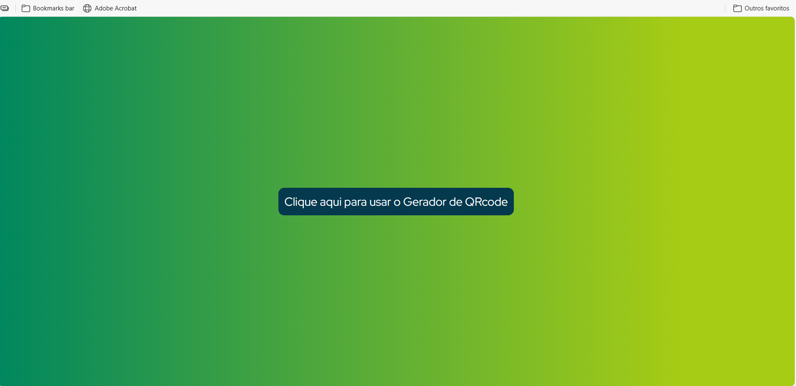
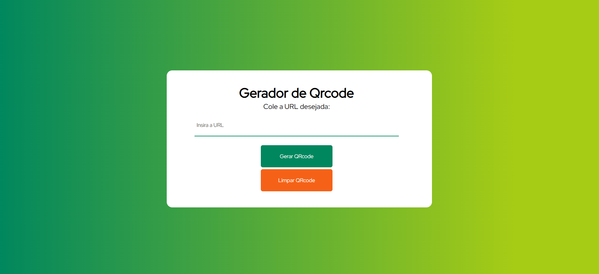

# 📱 Gerador de QR Code

Aplicação web simples para gerar QR Codes a partir de links, textos ou números.  
Utiliza **HTML**, **CSS**, **JavaScript**, **jQuery** e a **API QRServer** para transformar rapidamente qualquer entrada em um código QR escaneável.

---

## 📋 Como funciona
1. Digite ou cole o link, texto ou número no campo de entrada.
2. Clique no botão **"Gerar QRCode"**.
3. O QR Code será exibido na tela e pode ser lido por qualquer aplicativo de leitura.
4. Use o botão **"Limpar QRCode"** para reiniciar.

---

## ✨ Funcionalidades
- Geração de QR Code em tempo real.
- Validação para evitar campo vazio.
- Layout simples e responsivo.
- Botão de limpeza para reiniciar rapidamente.

---

## 🛠 Tecnologias
- **HTML5** – Estrutura.
- **CSS3** – Estilização e responsividade.
- **JavaScript** – Lógica de funcionamento.
- **jQuery** – Interações e animações.
- **API QRServer** – Geração do código.

---

## 📸 Screenshots

### 💻 Versão Desktop – Tela Inicial

### ⌨️ Versão Desktop – Entrada de Dados

### 🖱 Versão Desktop – QR Code Gerado

> As imagens acima estão na pasta `docs/` e serão exibidas automaticamente no GitHub.

---

## 👨‍💻 Autor
Márcio Xavier – [xaviermarcio80@gmail.com](mailto:xaviermarcio80@gmail.com)
